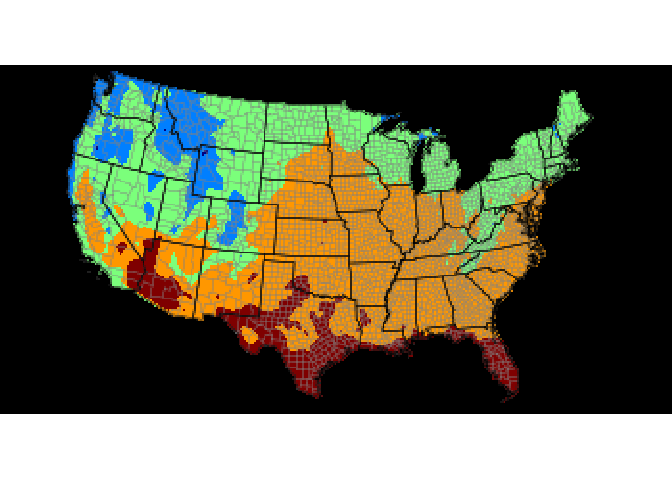

<!-- README.md is generated from README.Rmd. Please edit that file -->

# acis

<!-- badges: start -->
<!-- badges: end -->

The goal of acis is to provide wrapper functions for Applied Climate
Information System (ACIS) Web Services.

ACIS Web Services (described at
<http://www.rcc-acis.org/docs_webservices.html>) are accessed by seven
types of calls: station metadata (StnMeta), raw or summarized climate
data for a single station for a range of dates (StnData), data for
multiple stations (MultiStnData), gridded data sets (GridData &
GridData2), hourly data (StnHourly), and metadata for a geographic area
(General).

## Installation

You can install the development version of acis from
[GitHub](https://github.com/) with:

``` r
# install.packages("devtools")
devtools::install_github("brownag/acis")
```

## Example

See <http://www.rcc-acis.org/docs_webservices.html> for information on
how to construct ACIS queries.

The following examples demonstrate some capabilities of `acis_query()` a
low-level function for constructing queries from a parameter list, and
handling output types.

``` r
library(acis)

# ITHACA CORNELL UNIV (sid: 304174; -76.44905, 42.44915; 960m elev)
s <- 304174

# get metadata for a station
acis_query(
 "StnMeta",
 params = list(
   sids = s,
   output = 'json'
 )
)
#> $meta
#> $meta[[1]]
#> $meta[[1]]$name
#> [1] "ITHACA CORNELL UNIV"
#> 
#> $meta[[1]]$ll
#> $meta[[1]]$ll[[1]]
#> [1] -76.44905
#> 
#> $meta[[1]]$ll[[2]]
#> [1] 42.44915
#> 
#> 
#> $meta[[1]]$sids
#> $meta[[1]]$sids[[1]]
#> [1] "304174 2"
#> 
#> $meta[[1]]$sids[[2]]
#> [1] "USC00304174 6"
#> 
#> $meta[[1]]$sids[[3]]
#> [1] "ITHN6 7"
#> 
#> 
#> $meta[[1]]$state
#> [1] "NY"
#> 
#> $meta[[1]]$elev
#> [1] 960
#> 
#> $meta[[1]]$uid
#> [1] 18667

# get average+max temperature, and precipitation for January 2020
acis_query(
  "StnData",
  params = list(
    sid = s,
    sdate = '2020-01-01',
    edate = '2020-01-31',
    elems = 'avgt,maxt,pcpn',
    output = 'csv'
  )
)
#> Warning in data.table::fread(q): Detected 1 column names but the data has 4
#> columns (i.e. invalid file). Added 3 extra default column names at the end.
#>            V1   V2 V3   V4
#> 1  2020-01-01 34.0 40 0.01
#> 2  2020-01-02 26.0 30    T
#> 3  2020-01-03 37.5 46 0.00
#> 4  2020-01-04 41.0 45 0.23
#> 5  2020-01-05 32.0 37 0.22
#> 6  2020-01-06 29.0 31 0.10
#> 7  2020-01-07 29.0 37    T
#> 8  2020-01-08 26.5 32 0.06
#> 9  2020-01-09 22.5 31 0.02
#> 10 2020-01-10 21.0 31    T
#> 11 2020-01-11 40.5 50 0.05
#> 12 2020-01-12 56.5 63 0.04
#> 13 2020-01-13 44.0 60 0.00
#> 14 2020-01-14 37.0 45 0.00
#> 15 2020-01-15 36.0 44 0.00
#> 16 2020-01-16 35.5 43 0.16
#> 17 2020-01-17 23.5 37 0.08
#> 18 2020-01-18  8.0 12 0.00
#> 19 2020-01-19 22.5 35 0.15
#> 20 2020-01-20 22.0 32 0.05
#> 21 2020-01-21 13.5 18    T
#> 22 2020-01-22 15.0 25 0.00
#> 23 2020-01-23 20.5 36 0.00
#> 24 2020-01-24 31.0 39 0.00
#> 25 2020-01-25 40.0 48 0.06
#> 26 2020-01-26 33.0 35 1.29
#> 27 2020-01-27 33.5 36 0.03
#> 28 2020-01-28 31.0 34 0.05
#> 29 2020-01-29 26.5 30 0.16
#> 30 2020-01-30 14.5 23 0.00
#> 31 2020-01-31 17.5 29 0.00

library(terra)
#> terra 1.6.22
# CONUS NRCC Interpolated Average Monthly Temperature (June 2020)
# specify params as raw JSON, and output=image in params list
g <- acis_query(
  "GridData",
  params = list(
    params = '{"state":"me,ca,fl,wa","grid":"1","output":"image","date":"2020-6","elems":[{"name":"avgt","interval":"mly","duration":"mly","reduce":"mean"}],"image":{"proj":"lcc","overlays":["county:0.25:gray","state:0.5:black"],"interp":"cspline","width":350}}',
    output = 'image'
  )
)
#> Warning: [rast] unknown extent
plotRGB(g)
```


